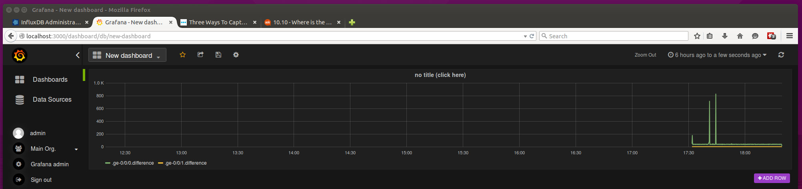

# What is Juniper-Grafana?

Juniper-Grafana allows you to visualize statistics and telemetry from [Juniper Networks](http://juniper.net) devices using Grafana.

Because we use [NETCONF](http://www.juniper.net/documentation/en_US/junos13.2/information-products/pathway-pages/netconf-guide/netconf.html) to gather telemetry from the device, this should work with any Juniper device including [SRX](http://juniper.net/srx) firewalls, [MX](http://juniper.net/mx), [PTX](http://www.juniper.net/us/en/products-services/routing/ptx-series/), and [ACX](http://www.juniper.net/us/en/products-services/security/srx-series/vsrx/) routers, [EX](http://juniper.net/ex), [QFX](http://www.juniper.net/us/en/products-services/switching/qfx-series/), and [OCX](http://www.juniper.net/us/en/products-services/switching/ocx1100/) switches, including virtual devices such as the [vSRX](http://www.juniper.net/us/en/products-services/security/srx-series/vsrx/) virtual firewall and the [vMX](http://www.juniper.net/us/en/products-services/routing/mx-series/vmx/) virtual router.  We only tested with vSRX.

This example currently supports a limited set of interface statistics: bytes sent, bytes received, packets sent, packets received for every interface.  The intent is to add more statistics later on.
 
Juniper-Grafana is implemented using:

* [InfluxDB](http://influxdb.com/) as the time-series database.
* [Grafana](http://grafana.org/) for visualization.
* [PyEZ](http://techwiki.juniper.net/Automation_Scripting/010_Getting_Started_and_Reference/Junos_PyEZ) to implement the NETCONF interface to Juniper devices and gather telemetry data such as interface counters.
* The [vSRX](http://www.juniper.net/us/en/products-services/security/srx-series/vsrx/) virtual firewall to generate the telemetry data (as an example).

All examples and scripts below are written for 64-bit Ubuntu 15.04.

This is a personal project for fun.  It is not associated with Juniper Networks in any way, shape, or form.  There is no guarantee that this works or does anything useful.  There is no support.  If this causes your network to blow up, you cannot sue me.  You have been warned.  You are free to use this in any way you see fit subject to a few conditions.  See LICENSE file for same information in legalese.

# Installation

## Install Python

If not already installed, install Python and PIP:

```
sudo apt-get install --yes python-pip
sudo apt-get install --yes python-dev
```

## Install InfluxDB

Install [InfluxDB](http://influxdb.com/) for storing the collected telemetry:
```
wget https://s3.amazonaws.com/influxdb/influxdb_latest_amd64.deb
sudo dpkg -i influxdb_latest_amd64.deb
```

Start InfluxDB:

```
sudo /etc/init.d/influxdb start
```

You need to create a "network" time-series database that we will use later in the demo.

Open the graphical user interface by using a web browser to navigate to URL [http://localhost:8083](http://localhost:8083).  The default user name is root and the default password is root.

In the "Create Database" form, enter "network" in the Database Name field, and click on the "Create Database" button.

## Install Grafana:

Install [Grafana](http://grafana.org/) for visualization:
```
wget https://grafanarel.s3.amazonaws.com/builds/grafana_2.0.2_amd64.deb
sudo apt-get install -y adduser libfontconfig
sudo dpkg -i grafana_2.0.2_amd64.deb
```

Start Grafana:
```
sudo service grafana-server start
```

Open the graphical user interface by using a web browser to navigate to URL [http://localhost:3000](http://localhost:3000).  The default user name is admin and the default password is admin.

## Install PyEZ

Install [PyEZ](https://techwiki.juniper.net/Automation_Scripting/010_Getting_Started_and_Reference/Junos_PyEZ) for the Python NETCONF client 
```
sudo apt-get install --yes libxml2-dev
sudo apt-get install --yes libxslt1-dev
pip install junos-eznc
```

## Install vSRX

You will need some Juniper device to gather statistics from.  We use vSRX for testing.  If you have a Juniper support account you can download vSRX from [http://www.juniper.net/support/downloads/?p=firefly#sw](http://www.juniper.net/support/downloads/?p=firefly#sw).  You can download it as a VMware virtual machine or a KVM virtual machine.  Note that the product may be called JunosV Firefly Perimeter (or just Firefly for short) on the download page; that is the old name for vSRX.

Start the downloaded vSRX image using the virtual machine manager of your choice.

Login to the vSRX using the console.  The default user name is root and initially it does not have a password (we will set one below).

We use vSRX on VMware Fusion 7 on an Apple iMac.  It is a little bit tricky to get the management interface (ge-0/0/0) to come up.  You have to go into the VMware Fusion virtual machine settings and configure the first network adapter as follows: enable "Connect Network Adapter" and "Share with my Mac".  Then restart the virtual machine.  Once vSRX has restarted, connect to the console, login as root (no password), and statically assign an IP address to the ge-0/0/0.0 interface, for example:

```
root@% cli
root> configure 
Entering configuration mode

[edit]
root# set interfaces ge-0/0/0 unit 0 family inet address 192.168.229.185/24  

[edit]
root# commit and-quit 
commit complete
Exiting configuration mode
```

You should pick an unused address on the same subnet as vmnet8 interface in the host:

```
$ ifconfig vmnet8
vmnet8: flags=8863<UP,BROADCAST,SMART,RUNNING,SIMPLEX,MULTICAST> mtu 1500
	ether 00:50:56:c0:00:08 
	inet 192.168.229.1 netmask 0xffffff00 broadcast 192.168.229.255
```

You also need to create a user to allow NETCONF connections to be established.  Junos won't let you commit the configuration change unless you also assign a password to the root user.  For example:

```
test> configure 
Entering configuration mode

[edit]
root# set system root-authentication plain-text-password    
New password:
Retype new password:

[edit]
root# set system login user test class super-user authentication plain-text-password 
New password:
Retype new password:

[edit]
test# commit and-quit 
commit complete
Exiting configuration mode

test> 
```  

At this point you should be able to SSH into the vSRX.

```
$ ssh test@192.168.229.185
Password:
--- JUNOS 12.1X47-D20.7 built 2015-03-03 21:53:50 UTC
test> 
```

Finally, you also need to enable NETCONF:

```
test> configure 
Entering configuration mode

[edit]
test# set system services netconf ssh 

[edit]
test# commit and-quit 
commit complete
Exiting configuration mode

test> 
```

We will only use the CLI and NETCONF interface, but in case you are interested, vSRX also provides a web interface: [http://192.168.229.185](http://192.168.229.185).

## Installation script

The install.sh and startup.sh scripts automate all of the above installation steps, except for vSRX installation.

# The demo

## The poll-juniper.py script

The poll-juniper.py python script is an example of how to use PyEZ to retrieve statistics from a Juniper device and inject them into an InfluxDB time-series database.

It is not intended to be production quality code: it only collects statistics from a single device, lots of parameters that should be configurable are hard-coded, error handling is non-existent, etc.

The script uses PyEZ to open a NETCONF connection to Juniper device, in our case a vSRX.  We use port 22 (SSH) instead of the default port 830 because for some reason port 830 traffic doesn't make it through the VMware NAT between my Linux VM and my vSRX VM.

```
device = Device(host=device_ip, port=22, user=user_name, passwd=password)
device.open()
```

We display some information about the device:
```
switch_name = device.facts['fqdn']
print 'Connected to', switch_name, '(', device.facts['model'], 'running', device.facts['version'], ')'
```

We determine the list of ports on the device:
```
ports_table = EthPortTable(device)
```

We connect to the InfluxDB database.  The time-series database "network" was previously created in the installation steps:
```
db = client.InfluxDBClient('localhost', 8086, 'root', 'root', 'network')
```

We go into an endless loop.  In each iteration we retrieve the operational attributes for the ports:
```
ports = ports_table.get()
```

We then iterate over all the ports and create data points for the counters:
```
point = {'name': switch_name + '.' + port['name'],
             'columns': columns,
             'points': [[int(port['rx_packets']), 
                         int(port['rx_bytes']), 
                         int(port['tx_packets']), 
                         int(port['tx_bytes'])]]}
```

Finally, we write the data points into the time-series database:
```
db.write_points([point])
```

## Collecting statistics

Run the poll-juniper.py script to start gathering statistics:

```
$ influxdb -v
$ python poll-juniper.py 
No handlers could be found for logger "paramiko.hostkeys"
Connected to  ( FIREFLY-PERIMETER running 12.1X47-D20.7 )
Connected to InfluxDB
Collecting metrics...
```

## Viewing the time-series database

We can look at the contents of the "network" time-series database in InfluxDB to make sure that statistics as being collected.

As before, open the graphical user interface by using a web browser to navigate to URL [http://localhost:8083](http://localhost:8083).  The default user name is root and the default password is root.

Click on "Databases" in the main menu at the top, and click on "Explore Data" for the "networks" database.  Enter "select * from /.*/" in the Query field and click on the "Execute Query" button.

You should see graphs and a time-series table for the interface counters.

## Generate some traffic

We log in to the vSRX and issue a fast ping to generate a burst of traffic to make the graphs look a little bit more interesting:

```
$ ssh root@192.168.229.185
Password:
--- JUNOS 12.1X47-D20.7 built 2015-03-03 21:53:50 UTC
root@% ping -f 192.168.229.185
PING 192.168.229.185 (192.168.229.185): 56 data bytes
.........................................^C.
--- 192.168.229.185 ping statistics ---
6042 packets transmitted, 6000 packets received, 0% packet loss
round-trip min/avg/max/stddev = 0.069/0.090/0.418/0.029 ms
```

## Visualizing statistics

Now we use Grafana to visualize the counters.

Open the graphical user interface by using a web browser to navigate to URL [http://localhost:3000](http://localhost:3000).  The default user name is admin and the default password is admin.

Click on the "Grafana" icon in the top left of the screen (it will change into a menu icon when you hover over it)

Select "Data Sources" in the left menu.

Select "Data sources > Add new" in the top menu.

Enter the following information:

| Field    | Enter value           |
| -------- | --------------------- |
| Name     | network               |
| Url      | http://localhost:8086 |
| Type     | InfluxDB 0.8.x        |
| Database | network               |
| User     | root                  |
| Password | root                  |

Select "Dashboards" in the left menu.

Select "Home" in the top menu.

Click on the "+ New" button in the drop down menu.

Click on the little green bar in the first and only row, select "Add Panel" in the menu, and then "Graph"

In the graph row, click on "no title (click here)".  Select "edit". A new menu will appear below the graph row.

Select "Metrics".  Click the button in the bottom right that says "Grafana" (it says Datasource when you hover over it) and select "network" as the data source.

For the first series, enter "/.*/" in the series field.  In the select field, click on "mean" and select "difference", then click on "value" and select "tx_packets".

Remove the 2nd and 3rd series by clicking on the "x" button on the right.

Click on "Back to dashboard"

Click on the floppy disk icon at the top (it will say "Save dashboard" when you hover over it)




